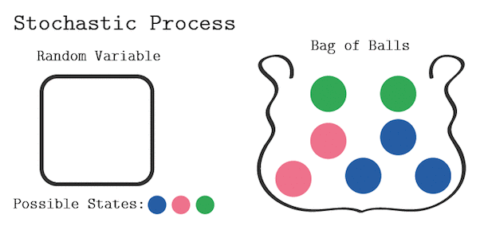
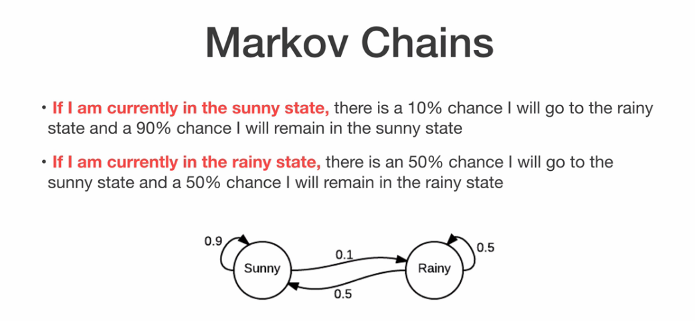

# Markov Chain Sentence Generator (fake news headlines)
## Python Pizza Hamburg New Year's 2020
### Structure
* Motivation
Use Python to analyse and recreate fake news headlines using Markov Chain system.
* Method
- What is Markov Chain? "Is a mathematical system that says that no matter how the process arrived at the current state,
  the future states have a fixed probability. It is said to be memory-less since it only keeps record of one past state (Markov property).
  experiences transitions from one state to another according to 
  certain probabilistic rules. The defining characteristic of such system is that no matter how the process arrived at 
  its present state, the possible future states are fixed." [Brilliant.org](https://brilliant.org/wiki/markov-chains/).
  Can also be describes as "A way of representing how systems change overtime"[Alice Zhao, 2019](https://youtu.be/MGVdu39gT6k?t=141).
  
- The basic concept is that the next state is only dependent on the previous one, which makes them memoryless.
  (explain with .gif visual aids. Add the diagram. Mention matrices.)
  
- 
- Each state would represent a word;
- Arrows will sign the probabiblity of the following word
- represented by a dictionary.
- we start with ine word and python chooses the next to form a sentence

> ## Step-by-step method
> * Create a dictionary where the keys are the current state (current word in a sentence) and
> * Values are options for the next state.
> `generate_random()` will create the next terms in the sentence
> output: (python-generated) fake news headlines
>  

* Fake news is no joke:
    - These people are trying to find out how AI can help on the fake news battle [Fake News Challenge](http://www.fakenewschallenge.org/). [GitHub](https://github.com/FakeNewsChallenge)
    - [FakeNewsNet](https://arxiv.org/abs/1809.01286) A Data Repository with News Content, Social Context and Spatialtemporal Information for Studying Fake News on Social Media
    

[comment]: <> (API key = 1ff8071aaff84b0eba4ac4335456ddb7 ) not useful!

Data BS from here: https://www.kaggle.com/mrisdal/fake-news

## Want a better fake news generator? What about a Fake Trump Tweeter? [Filip](https://twitter.com/filiphracek/status/708021106188288001) got you covered!
  
https://www.kaggle.com/c/fake-news
https://www.kaggle.com/c/fake-news/data?select=train.csv

# URL TNYT Jan 2020 to Dec 2020 trump news
url = https://www.nytimes.com/search?dropmab=false&endDate=20201230&query=trump&sort=best&startDate=20200101
.
url_2=https://www.independent.ie/
url_bbc = https://www.bbc.co.uk/search?q=5g&page=11

newspaper is this oython library to curate articles. Inspired by requests, it allows you to extract keywords and summaries. and it also works with other languages than english.
2 states > 4 possible transitions
